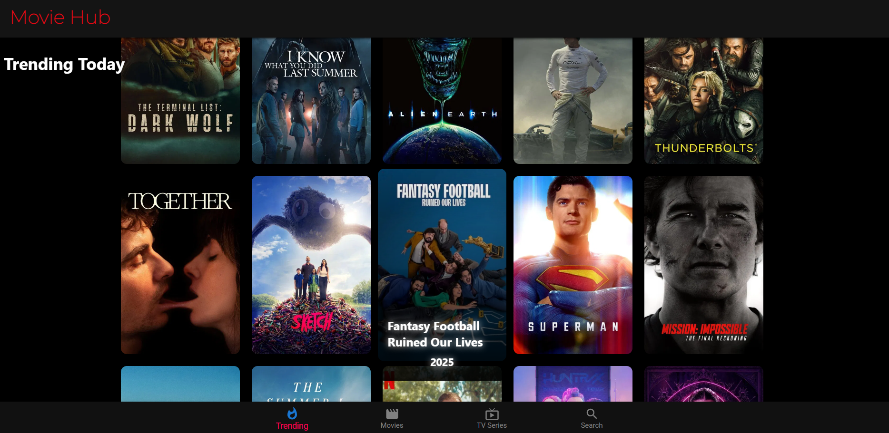
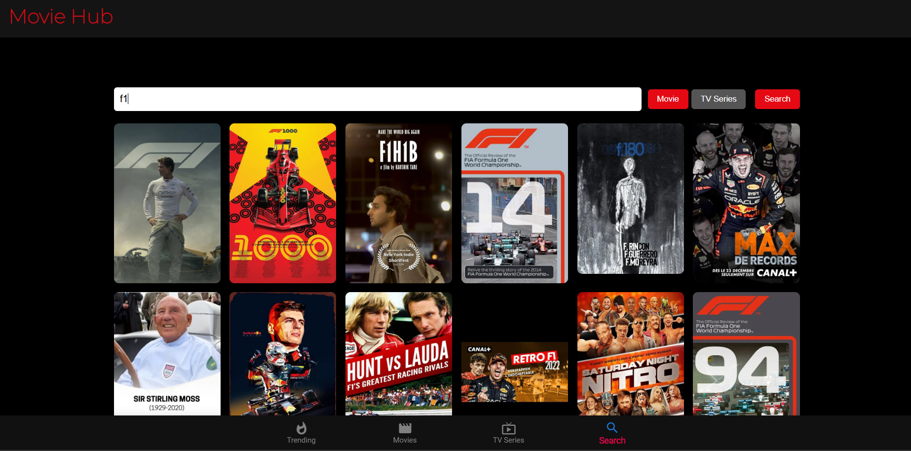
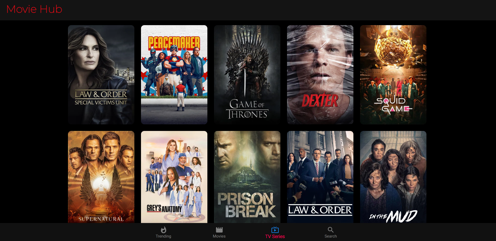

# 🎬 Movie Hub – Movie Discovery App

Movie Hub is a React-based web application that allows users to explore trending movies & TV shows, search for titles, and view trailers.  
The app is deployed on Render for live access.  

🔗 **Live Demo:** [Movie-app on Render](https://movie-app-3ell.onrender.com)  

---

## ✨ Features
- 🔥 Browse trending movies and TV series  
- 🔍 Search movies and TV shows by title   
- 📱 Responsive UI for mobile & desktop  
- 🚀 Fast performance with React  

---

## 🛠️ Tech Stack
- **Frontend:** React, Axios, CSS  
- **API:** [TMDB API](https://www.themoviedb.org/)  
- **Deployment:** Render  

---

## 📸 Screenshots


  
  
  

---

## ⚡ Getting Started

Follow these steps to run the project locally:

```bash
# Clone the repository
git clone https://github.com/ySANDEEPKURUBA214/Movie-app.git

# Navigate to project folder
cd frontend
cd movie-app

# Install dependencies
npm install

# Start the development server
npm start

movie-app/
 ┣ src/
 ┃ ┣ components/   # Reusable components
 ┃ ┣ pages/        # Pages (Home, Search, Trending, TV)
 ┃ ┣ App.js        # Main app entry
 ┃ ┣ index.js
 ┣ public/         # Static assets
 ┣ package.json
 ┣ README.md

